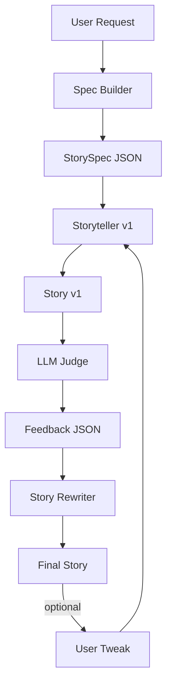

# Hippocratic AI Take-Home — Bedtime Storyteller + LLM Judge

This repo generates bedtime stories appropriate for ages **5–10** using:
1) a **Story Spec Builder** (creates a compact plan),
2) a **Storyteller** (drafts story),
3) an **LLM Judge** (scores + gives actionable rewrite instructions),
4) a **Revision loop** (improves the story 1–2 times).

Model requirement: uses **`gpt-3.5-turbo`** only.

## Architecture (Block Diagram)

ASCII:

```
User Request
   |
   v
[Spec Builder] ---> StorySpec (JSON plan)
   |
   v
[Storyteller v1] ---> Story v1
   |
   v
[LLM Judge] -----> Scores + Rewrite Instructions (JSON)
   |
   v
[Story Rewriter] -> Story v2 (repeat up to 2 revisions)
   |
   v
Final Story (+ optional user tweak loop)
```

Mermaid (optional):



## Quickstart

### Install
```bash
pip install -r requirements.txt
```

### Run with OpenAI key (local)
```bash
export OPENAI_API_KEY="YOUR_KEY"
python main.py
```

### Run offline (no key)
```bash
export USE_MOCK=true
python main.py
```

## Notes
- **Never commit** API keys. Keys are read from `OPENAI_API_KEY` environment variable only.
- The repo includes `USE_MOCK` mode so reviewers can run without credentials.

## Files
- `main.py` — end-to-end pipeline + mock mode + robust JSON parsing
- `DESIGN.md` — prompting & agent strategy
- `SETUP.md` — setup instructions (local + Colab)
- `test_main.py` — lightweight unit tests
- `examples.py` — sample story requests
- `SUBMISSION_GUIDE.md` — submission checklist
- `API_UPDATE.md` — what I'd build next
